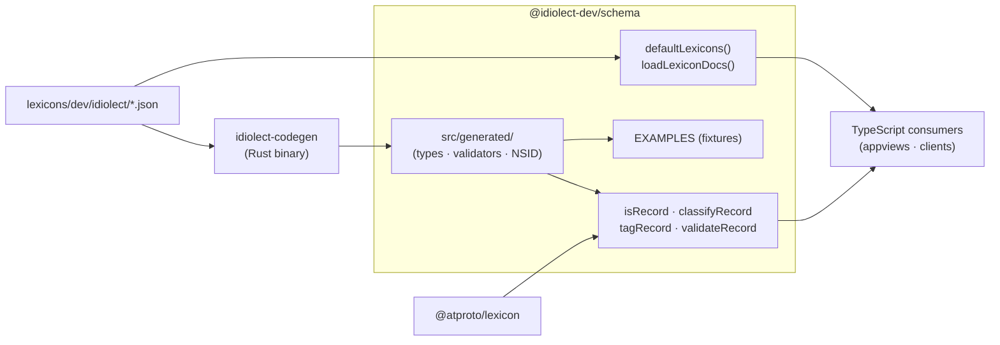

# @idiolect-dev/schema

TypeScript validators, record types, and NSID constants for the
`dev.idiolect.*` lexicon family.

## Overview

This package is the TypeScript counterpart of
[`idiolect-records`](../../crates/idiolect-records). Both are generated from
the lexicons under `lexicons/dev/idiolect/`, and CI rejects generated-source
drift. The public API contains per-record types, NSID constants, structural
validators, and helpers for tagged record unions.

## Architecture


```mermaid
flowchart LR
    LEX["lexicons/dev/idiolect/*.json"]
    CG["idiolect-codegen<br/>(Rust binary)"]

    subgraph pkg["@idiolect-dev/schema"]
        GEN["src/generated/<br/>(types · validators · NSID)"]
        API["isRecord · classifyRecord<br/>tagRecord · validateRecord"]
        FIX["EXAMPLES (fixtures)"]
        LEXDOCS["defaultLexicons()<br/>loadLexiconDocs()"]
    end

    ATLEX["@atproto/lexicon"]
    CONS["TypeScript consumers<br/>(appviews · clients)"]

    LEX --> CG --> GEN
    GEN --> API
    GEN --> FIX
    LEX --> LEXDOCS
    ATLEX --> API
    API --> CONS
    LEXDOCS --> CONS
```

## Install

```sh
bun add @idiolect-dev/schema
# or
npm install @idiolect-dev/schema
```

## Usage

```ts
import {
  NSID,
  isRecord,
  classifyRecord,
  type Encounter,
  type AnyRecord,
} from "@idiolect-dev/schema";

// Narrow an unknown payload to a typed record.
const payload: unknown = await fetch(recordUrl).then(r => r.json());
if (isRecord(NSID.encounter, payload)) {
  const e: Encounter = payload;
  console.log(e.kind);
}

// Identify the nsid of an unknown record.
const nsid = classifyRecord(payload); // returns the matching nsid or null

// Wrap a strongly-typed record into a tagged AnyRecord for buffering.
import { tagRecord } from "@idiolect-dev/schema";
const tagged: AnyRecord = tagRecord(NSID.encounter, e);
```

## What ships

- One record type per lexicon under `lexicons/dev/idiolect/`, plus shared
  types from `defs`.
- `NSID`: a typed constants object with every shipped NSID.
- `AnyRecord`: a discriminated union keyed on `$nsid`.
- `isKind` / per-record `is<Kind>` type guards.
- `validateRecord(nsid, value)`: atproto-level structural validation via
  `@atproto/lexicon`.
- `classifyRecord(value)`: returns the matching NSID or `null`.
- `tagRecord(nsid, record)`: lifts a typed record into the tagged union.
- `EXAMPLES` and per-record `*_EXAMPLE` constants: bundled minimally valid
  fixtures from `lexicons/dev/idiolect/examples/`.
- `loadLexiconDocs()` / `defaultLexicons()`: re-exported lexicon JSON
  plus a `Lexicons` instance for consumers that extend the validator set.

## Design notes

- The generated TypeScript under `src/generated/` is emitted by
  [`idiolect-codegen`](../../crates/idiolect-codegen). CI runs
  `cargo run -p idiolect-codegen -- check` and fails the build if the
  committed output differs from what the current lexicons would produce.
  Hand-edits to `src/generated/` never merge.

## Stability

idiolect is pre-1.0. Minor releases may change TypeScript exports, lexicon
shapes, wire formats, or the validator surface. Pin an exact version if you
depend on this package, and read [CHANGELOG.md](../../CHANGELOG.md) before
upgrading.

## Related

- [`idiolect-records`](../../crates/idiolect-records): Rust package
  generated from the same lexicons.
- [`idiolect-codegen`](../../crates/idiolect-codegen): emits this package.
